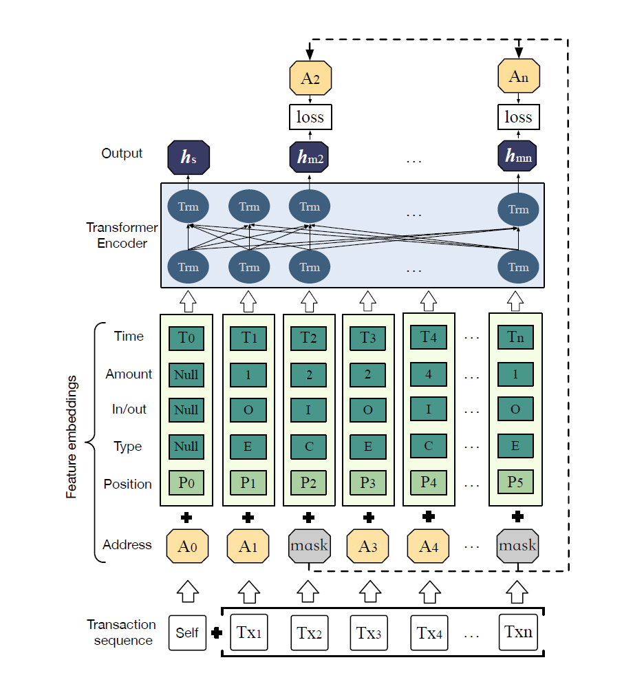

# Fraud Detection using AI

A curated list of papers concerning fraud detection using AI

### Survey

**July, 2023**: We summarized the current state of the fraud detection using transformer and neural network models in the following survey paper (work in progress)

> `<Author1>`, `<Author2>`.  **Fraud Detection using Artificial Intelligence: A Survey**.

### Abstract

The rapid advancement of artificial intelligence (AI) has significantly impacted various sectors, with fraud detection being one of the most critical applications. Leveraging transformer models and neural networks, AI has demonstrated remarkable capabilities in identifying and preventing fraudulent activities with greater accuracy and efficiency. This survey aims to provide a comprehensive summary of the most influential research papers that have explored the use of AI in fraud detection. By analyzing various methodologies, model architectures, and their respective outcomes, this survey highlights the key trends and innovations in the field. Looking forward, the future direction of AI in fraud detection is poised to focus on data compression and downstream tasks. Effective data compression techniques will be essential in handling the vast amounts of data generated and ensuring that models can process this information efficiently. Furthermore, the integration of AI-driven fraud detection with downstream tasks, such as real-time decision-making and automated response systems, will enhance the overall effectiveness and responsiveness of fraud prevention strategies. By advancing in these areas, AI can continue to evolve, providing more sophisticated and agile solutions to the ever-growing challenge of fraud detection.

### Citation

## Related surveys

* [BERT4ETH: A Pre-trained Transformer for Ethereum Fraud Detection](https://doi.org/10.48550/arXiv.2303.18138)
  
  

  
 Sihao Hu et al.  
      <em>The ACM Web Conference</em>, 2023 

    As various forms of fraud proliferate on Ethereum, it is imperative to safeguard against these malicious activities to protect susceptible users from being victimized. While current studies solely rely on graph-based fraud detection approaches, it is argued that they may not be well-suited for dealing with highly repetitive, skew-distributed and heterogeneous Ethereum transactions. To address these challenges, we propose BERT4ETH, a universal pre-trained Transformer encoder that serves as an account representation extractor for detecting various fraud behaviors on Ethereum. BERT4ETH features the superior modeling capability of Transformer to capture the dynamic sequential patterns inherent in Ethereum transactions, and addresses the challenges of pre-training a BERT model for Ethereum with three practical and effective strategies, namely repetitiveness reduction, skew alleviation and heterogeneity modeling. Our empirical evaluation demonstrates that BERT4ETH outperforms state-of-the-art methods with significant enhancements in terms of the phishing account detection and de-anonymization tasks. The code for BERT4ETH is available at: <a href="https://github.com/git-disl/BERT4ETH" rel="external noopener nofollow" class="link-external link-https">this https URL</a>.
  

   

* [Generative Pretraining at Scale: Transformer-Based Encoding of Transactional Behavior for Fraud Detection](https://doi.org/10.48550/arXiv.2312.14406)
  
  

  
 Ze Yu Zhao et al. 
      <em>arXiv preprint arXiv:2312.14406</em>, 2023 

    In this work, we introduce an innovative autoregressive model leveraging Generative Pretrained Transformer (GPT) architectures, tailored for fraud detection in payment systems. Our approach innovatively confronts token explosion and reconstructs behavioral sequences, providing a nuanced understanding of transactional behavior through temporal and contextual analysis. Utilizing unsupervised pretraining, our model excels in feature representation without the need for labeled data. Additionally, we integrate a differential convolutional approach to enhance anomaly detection, bolstering the security and efficacy of one of the largest online payment merchants in China. The scalability and adaptability of our model promise broad applicability in various transactional contexts.
  

